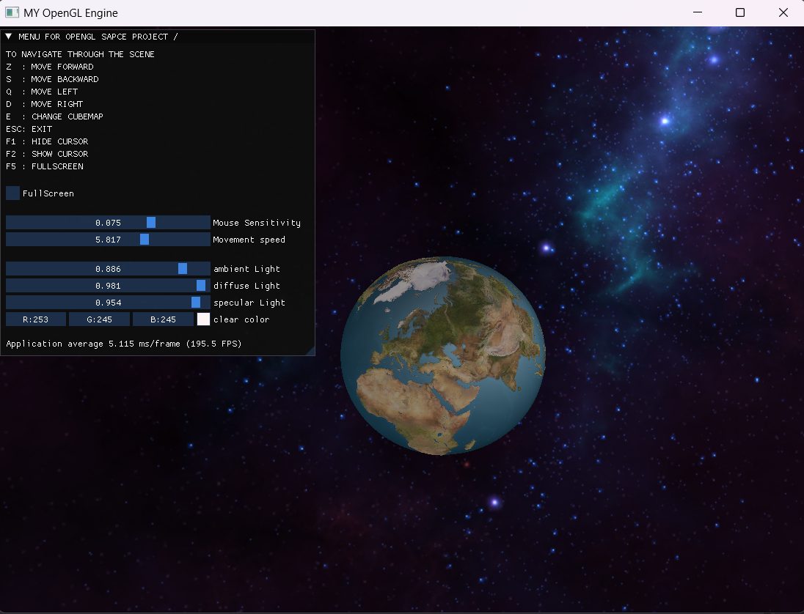
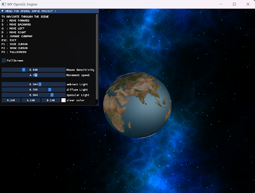

# Earth-s-orbit-and-universe-simulation-Project
Dans le cadre de ce projet, nous avons développé une simulation de l'orbite terrestre et de l'univers en utilisant OpenGL, avec un accent particulier sur les fonctionnalités modernes de C++11 et C++14. Le code a été structuré en classes, rendant le projet plus orienté objet et facilitant sa maintenance et son évolutivité. Nous avons également intégré la bibliothèque ImGui pour ajouter un HUD (Head-Up Display) interactif. Le projet comprend l'utilisation complète des techniques d'éclairage, ainsi que la programmation de shaders géométriques pour des effets visuels avancés.
 

## Caractéristiques Principales
- Effets de Lumière et d'Ombre : Utilisation de techniques d'éclairage avancées pour accentuer la profondeur et le réalisme.
- Textures Réalistes : Application de textures spécifiques pour représenter fidèlement la Terre et l'espace environnant.
- Interactions Utilisateur : Contrôles de zoom, déplacement, et modification de l'arrière-plan via le clavier et la souris.
- Interface Utilisateur : Intégration d'ImGui pour un HUD interactif permettant une navigation intuitive.
- Shaders Géométriques : Programmation de shaders pour des effets visuels avancés, incluant la gestion d'une Skybox.

## Structure du Projet
Le projet est structuré en plusieurs modules pour une gestion efficace et une extensibilité :

1. Bibliothèques Utilisées : GLFW, GLEW, GLM, ImGui, stb_image.
2. Interaction Utilisateur : Classes pour la gestion de la caméra, du clavier, de la souris, et de l'interface utilisateur.
3. Shaders : Shaders pour les effets visuels, incluant des shaders de géométrie et des shaders de Skybox.
4. Gestion des Buffers : Classes pour la manipulation des tampons de vertex et d'indices.
5. Gestion des Textures : Classes pour la représentation des textures, y compris le fond de scène (Skybox) et la texture de la Terre.
6. Utilitaires : Classes pour la gestion des shaders, le rendu, et la gestion des erreurs GPU.

Ces deux images illustrent les différents cubemaps que l'on peut utiliser dans le projet.

### Cubemap 1 

### Cubemap 2

